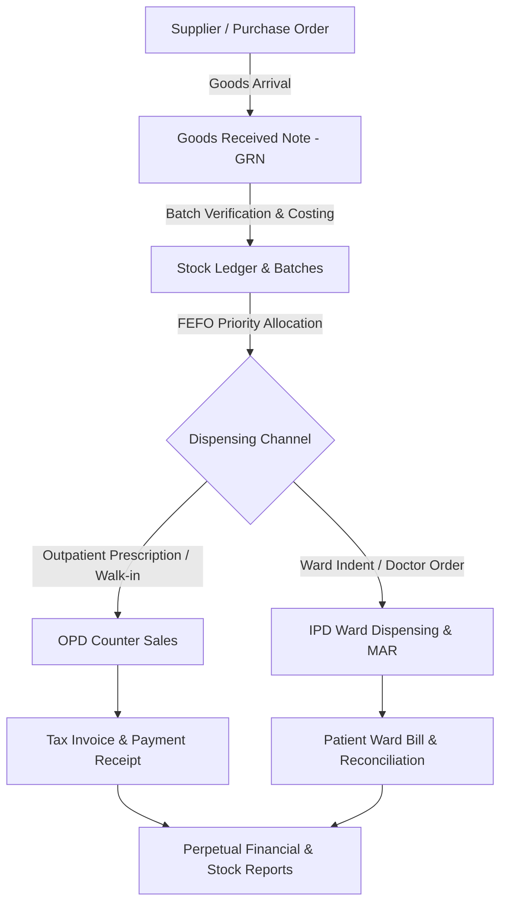

# MediCORE Pharmacy Management System

[](https://www.php.net/)
[](https://www.mysql.com/)
[](#license)
[](#)

**MediCORE Pharmacy** is an enterprise-grade Hospital & Clinical Pharmacy Management System engineered specifically for high-throughput healthcare institutions, multi-ward hospital facilities, and outpatient clinical pharmacies.

Built with a clinical-first UI, real-time FEFO (First-Expiry, First-Out) inventory control, automated ward indent workflows, and robust audit traceability.

---

## 📋 Table of Contents

- [Key Features](#-key-features)
- [System Architecture](#-system-architecture)
- [Tech Stack](#-tech-stack)
- [Installation & Setup](#-installation--setup)
- [Default User Credentials](#-default-user-credentials)
- [Database Structure](#-database-structure)
- [Core Workflows](#-core-workflows)
- [Security & Compliance](#-security--compliance)
- [Contributing](#-contributing)
- [License](#-license)

---

## 🌟 Key Features

### 1. 🏥 Outpatient & Counter Sales (OPD)
- **High-Speed Counter Billing (POS):** Rapid dispensing with barcode scanning, hotkey keyboard navigation, and instant batch selection.
- **Prescription Integration:** Seamless retrieval of clinical prescriptions with automated dosage-to-batch mapping.
- **Payment Flexibility:** Multi-mode tender support (Cash, Card, UPI, Credit) with split-payment capabilities.
- **Sales Returns & Credit Notes:** Controlled refund workflows linked directly to original invoices and stock restitution.

### 2. 🛏️ Inpatient Pharmacy & Ward Dispensing (IPD)
- **Ward Indent Processing:** Real-time fulfillment queue for ward drug requests, patient bed tracking, and nurse administration.
- **Medication Administration Records (MAR):** Complete scheduling, administration timestamps, and nursing sign-offs.
- **Discharge Clearance:** Immediate billing reconciliation and discharge audit checks to avoid unbilled dispensations.

### 3. 📦 Inventory & FEFO Batch Management
- **FEFO Dispensing Priority:** Automated batch suggestion prioritizing nearest-expiry inventory.
- **Live Stock Ledger:** Perpetual inventory tracking with double-entry stock transactions for every inbound and outbound unit.
- **Expiry Forecasting & Quarantine:** Multi-tier threshold alerts (30/60/90 days), automated stock quarantine, and authorized disposal registers.
- **Stock Adjustments & Audits:** Controlled physical stock reconciliation with reason logging and manager approvals.

### 4. 🚚 Procurement & Supply Chain
- **Supplier Relationship Management:** Complete vendor profiles, GSTIN details, credit terms, and payment ledgers.
- **Purchase Orders (PO):** Multi-item order creation with rate history and status workflows (*Draft &rarr; Approved &rarr; Received*).
- **Goods Received Note (GRN):** Strict 2-way and 3-way matching of physical deliveries against POs and vendor invoices.
- **Accounts Payable:** Supplier invoice registration, partial payment tracking, and outstanding balance summaries.

### 5. 📊 Clinical & Executive Analytics
- **Live Operations Dashboard:** Real-time KPI cards for Daily Sales, Pending Receivables, Stock Alerts, and Expiring Batches.
- **Traceability Reports:** Complete batch recall logs, audit trails, and inventory movement histories.
- **Financial & Tax Reporting:** Detailed GST breakdowns, sales summaries, and profit margin analysis.

---

## 🏗️ System Architecture

```
Pharmacy/
├── assets/
│   ├── css/               # Core design tokens, layout & component styles
│   ├── js/                # Hotkey navigation, searchable selects, dynamic POS logic
│   └── fonts/             # Self-hosted typography (Inter, Tabler Icons)
├── config/
│   ├── app.php            # Application constants, environment configs
│   ├── database.php       # PDO connection & pool parameters
│   └── session.php        # Secure cookie parameters & session lifecycle
├── database/
│   ├── migrations/        # 33 progressive database migration scripts
│   ├── pharmacy_clean_install.sql # Consolidated clean schema & seed
│   └── import_hospital_full_data.php # Automated data sync script
├── includes/
│   ├── header.php         # Global head, meta tags, and CSP policy
│   ├── navbar.php         # Top navigation header & user profile menu
│   ├── sidebar.php        # Role-aware collapsible clinical navigation
│   ├── permissions.php    # RBAC permission middleware & guards
│   ├── pharmacy_stock_helper.php # Core transactional stock ledger engine
│   └── footer.php         # Global scripts & toast notification container
├── modules/
│   ├── admin/             # Users, RBAC Roles, System Settings, Audit Logs
│   ├── dashboard/         # Real-time clinical operations dashboard
│   ├── inventory/         # Products, Batches, Stock Ledger, Expiry, Quarantine
│   ├── ipd/               # Ward Indents, MAR Register, Bed Reconciliation
│   ├── patients/          # Patient Registry, Search, Clinical History
│   ├── purchases/         # Suppliers, POs, GRN, Purchase Invoices, Payments
│   ├── reports/           # Financial, Stock Valuation, Traceability & Sales reports
│   └── sales/             # OPD Counter Sales, IPD Billing, Invoices, Returns
├── storage/               # Secure logs, temporary files, session locks
├── index.php              # App gateway & router
└── login.php              # Multi-role authentication & CSRF validation
```

---

## 💻 Tech Stack

| Layer | Technologies |
| :--- | :--- |
| **Backend** | PHP 8.0+ (Vanilla, Object-Oriented Architecture, Strict Typing) |
| **Database** | MySQL 5.7+ / MariaDB 10.4+ (InnoDB Engine, UTF8MB4, ACID Compliant) |
| **Frontend** | HTML5, Bootstrap 5.3, Custom Vanilla CSS Design System |
| **Icons & UI** | Tabler Icons, Custom Clinical ERP Components |
| **Client Scripting** | Vanilla JavaScript (ES6+), Fetch API (Zero bloated dependencies) |
| **Security** | Prepared PDO Statements, CSRF Tokens, Secure Session Headers, Strict CSP |

---

## 🚀 Installation & Setup

### Prerequisites
- [XAMPP](https://www.apachefriends.org/) / [WampServer](https://www.wampserver.com/) / [LAMP](https://en.wikipedia.org/wiki/LAMP_(software_bundle)) stack running **PHP 8.0+** and **MySQL 5.7+**
- Apache with `mod_rewrite` enabled

### 1. Clone the Repository
```bash
cd c:/xampp/htdocs/
git clone https://github.com/halikar-70/MediCORE-Pharmacy.git Pharmacy
```

### 2. Configure Database Connection
Open `config/database.php` and set your local MySQL credentials if different from default:
```php
define('DB_HOST', 'localhost');
define('DB_NAME', 'pharmacy_db');
define('DB_USER', 'root');
define('DB_PASS', '');
define('DB_PORT', 3306);
```

### 3. Import the Database
You can import the database via phpMyAdmin or MySQL CLI:

```bash
# Create database
mysql -u root -p -e "CREATE DATABASE IF NOT EXISTS pharmacy_db CHARACTER SET utf8mb4 COLLATE utf8mb4_unicode_ci;"

# Import consolidated schema and seed data
mysql -u root -p pharmacy_db < c:/xampp/htdocs/Pharmacy/pharmacy_db.sql
```

*(Alternatively, run the automated data synchronization script in your terminal: `php database/import_hospital_full_data.php`)*

### 4. Launch Application
Start Apache & MySQL in XAMPP Control Panel, then navigate to:
```
http://localhost/Pharmacy/
```

---

## 🔐 Default User Credentials

| Username | Password | Role | Description |
| :--- | :--- | :--- | :--- |
| `admin` | `admin123` | **Pharmacy Administrator** | Full unrestricted access to all clinical, procurement, and administrative modules. |
| `pharmacist` | `pharmacist123` | **Pharmacist** | OPD Counter Sales, Prescription Dispensing, and Stock Inquiries. |
| `ipd_staff` | `ipd123` | **IPD Pharmacy Staff** | Ward Indents, MAR Management, and Inpatient Dispensing. |

---

## 🔄 Core Workflows



---

## 🛡️ Security & Compliance

- **SQL Injection Prevention:** 100% parameter-bound queries using PDO prepared statements.
- **Cross-Site Request Forgery (CSRF):** Unique cryptographic tokens validated on all state-mutating requests (`POST`, `PUT`, `DELETE`).
- **Cross-Site Scripting (XSS):** Comprehensive output sanitization across all templates and reports.
- **Content Security Policy (CSP):** Strict CSP headers restricting unauthorized third-party script execution.
- **Granular RBAC:** Route-level and action-level permission checking across 40+ granular permissions.
- **Audit Logs:** Immutable tracking of user logins, role changes, stock adjustments, and invoice cancellations.

---

## 👥 Contributing

1. Fork the repository (`https://github.com/halikar-70/MediCORE-Pharmacy/fork`)
2. Create your feature branch (`git checkout -b feature/clinical-enhancement`)
3. Commit your changes (`git commit -m "Add new clinical dispensing feature"`)
4. Push to the branch (`git push origin feature/clinical-enhancement`)
5. Open a Pull Request

---

## 📄 License

This software is developed for **Vatsalya Hospital & Healthcare Systems**. All rights reserved.
